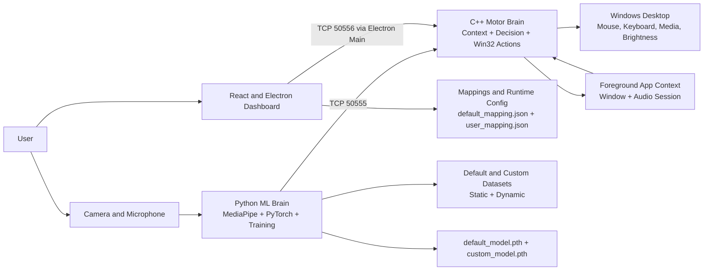
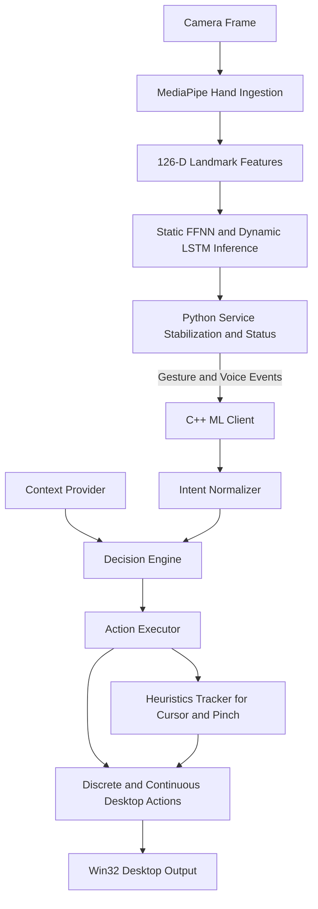
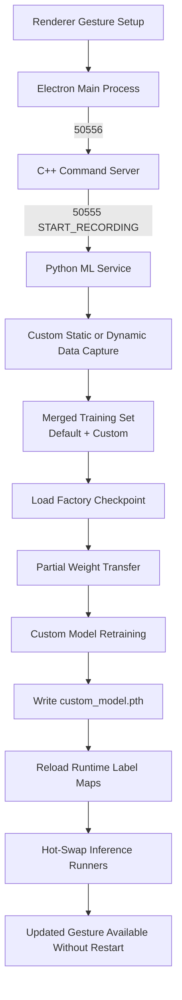
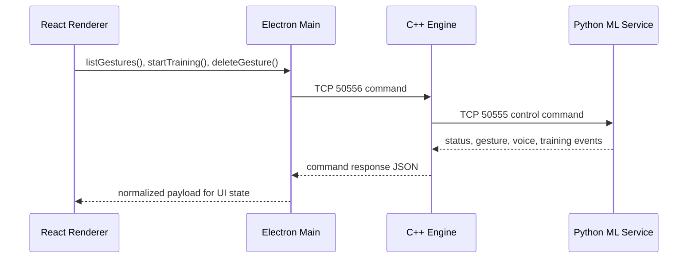

# Octave: Context-Aware Spatial Interface

Octave is a context-aware spatial interface that turns hand gestures and voice commands into adaptive desktop control by combining real-time machine learning, a Windows-native execution engine, and an Electron-based MLOps dashboard.

The system is designed around one central idea: the same gesture should mean different things depending on the active application, user mode, and runtime context. A vertical palm motion can become volume in media, zoom in design tools, scroll in browsers, or timeline control in playback workflows. Octave treats interaction as a live system, not a fixed shortcut table.

## Table of Contents

1. [What Octave Does](#what-octave-does)
2. [System Highlights](#system-highlights)
3. [Dual-Brain Architecture](#dual-brain-architecture)
4. [System Maps](#system-maps)
5. [End-to-End Runtime Flow](#end-to-end-runtime-flow)
6. [Context-Aware Routing](#context-aware-routing)
7. [Gesture and Model Pipeline](#gesture-and-model-pipeline)
8. [React and Electron MLOps Dashboard](#react-and-electron-mlops-dashboard)
9. [IPC Topology](#ipc-topology)
10. [Repository Layout](#repository-layout)
11. [Setup and Installation](#setup-and-installation)
12. [Development Workflow](#development-workflow)
13. [Performance Profile](#performance-profile)
14. [Contribution Guide](#contribution-guide)
15. [Design Notes and Guardrails](#design-notes-and-guardrails)

## What Octave Does

Octave provides a spatial interaction layer for Windows desktops with the following capabilities:

- Static gesture recognition from 126-dimensional landmark feature vectors
- Dynamic gesture recognition from fixed-length temporal sequences
- Context-sensitive action routing based on the active application and audio state
- Dual-mode interaction across `HAND` and `VOICE`
- Live custom gesture recording and retraining
- Runtime model hot-swap without restarting the Python service
- Windows-native execution of mouse, keyboard, media, brightness, and navigation actions

The default gesture inventory ships with:

- 7 static hand gestures
- 4 dynamic hand gestures
- 8 base gesture primitives that expand into 15+ context-specific actions

## System Highlights

- **Branding**: Octave is the project, product surface, and system identity used throughout this repository.
- **Dual-Brain design**: Python handles perception, inference, training, and model lifecycle. C++ handles orchestration, context, decisioning, and Win32 execution.
- **MLOps desktop control plane**: The React and Electron dashboard manages gesture libraries, live training, runtime status, and retraining workflows.
- **No catastrophic forgetting**: Custom model retraining merges factory and user datasets, then initializes from factory model weights before optimization.
- **Context-aware action expansion**: A compact gesture vocabulary maps to a much broader action surface once desktop context is applied.
- **Hot-swap runtime updates**: New `custom_model.pth` artifacts can be loaded into the live inference runners without process replacement.

## Dual-Brain Architecture

Octave is intentionally split into two cooperating brains.

### Sensory ML Brain: Python

The Python side lives under [`ml/`](C:/Dev/SPIDER/ml) and is responsible for perception and learning:

- MediaPipe hand ingestion and landmark extraction
- Static gesture inference with a PyTorch feed-forward network
- Dynamic gesture inference with a PyTorch LSTM
- Voice intake and phrase routing
- Recording custom training data
- Retraining custom static and dynamic models
- Reloading updated models and label maps at runtime

The Python service listens on TCP port `50555` and acts as the live ML endpoint for the rest of the system.

### Motor and Orchestration Brain: C++

The C++ engine lives under [`src/`](C:/Dev/SPIDER/src) and is responsible for actuation and policy:

- Launching and supervising the Python ML service
- Maintaining the internal event buses
- Tracking interaction mode
- Reading foreground app and audio session context
- Converting raw ML events into intent events
- Resolving context-aware actions
- Executing Win32 mouse, keyboard, media, and brightness actions
- Serving the command bridge used by the Electron UI

The C++ command server listens on TCP port `50556` and is the main-process entry point for the UI.

### Why the Split Matters

This separation keeps perception and execution independently evolvable:

- Python can iterate rapidly on models and datasets.
- C++ keeps desktop control low-latency, Windows-native, and operationally stable.
- UI workflows can ask the C++ engine for orchestration actions without coupling directly to ML internals.

## System Maps

The diagrams below are GitHub-friendly Mermaid diagrams that show how the full stack connects and how data moves through the system.

### High-Level Architecture



### Runtime Control Flow



### Training and Hot-Swap Flow



### IPC and Ownership Map



## End-to-End Runtime Flow

At runtime, the system moves through the following stages:

1. The C++ engine starts `ml/service.py` and opens its internal worker threads.
2. The Python service captures camera frames, runs MediaPipe, normalizes landmarks, and performs inference.
3. Gesture, voice, status, and training events stream from Python to C++ over port `50555`.
4. The C++ intent normalizer converts low-level signals into semantic intent events.
5. The context provider classifies the active process and inspects Windows audio session state.
6. The decision engine combines user mode, semantic intent, and desktop context to choose discrete actions or continuous domains.
7. The action executor applies Win32 actions directly or routes cursor-like control through the heuristics tracker.
8. The Electron UI calls into the engine command server on port `50556` for library operations, training, status, and mode changes.

## Context-Aware Routing

Octave is not a simple fixed gesture map. It uses desktop context to reinterpret gestures at runtime.

The context provider:

- Detects the foreground process
- Reads the foreground window title
- Classifies apps into modes such as `Browser`, `Media`, `Editor`, `Design`, `Presentation`, `Conferencing`, `Gaming`, and `Desktop`
- Checks whether audio is actively playing through the Windows Audio Session API
- Applies a short-lived media persistence rule so playback-related mappings remain stable even during app focus transitions

The decision engine then expands base gestures into context-specific actions. Examples:

- `Context: Swipe Left`
  - Browser: previous tab
  - Media: previous track
  - Editor or Design: undo
  - Presentation: previous slide
  - Default fallback: navigate back

- `Context: Swipe Right`
  - Browser: next tab
  - Media: next track
  - Editor or Design: redo
  - Presentation: next slide
  - Default fallback: navigate forward

- `Context: Dial Clockwise`
  - Media: volume up
  - Design: brush size increase
  - Desktop: switch tab
  - Gaming: next weapon

- `Mode: Context Slider`
  - Browser: scroll speed
  - Media: volume
  - Editor or Design: zoom
  - Desktop or Gaming: brightness

This is how 8 base gesture primitives scale into 15+ practical actions without requiring an overloaded gesture vocabulary.

## Gesture and Model Pipeline

### Input Features

The ML pipeline is built around normalized landmark features:

- Static inference uses 126-dimensional feature vectors
- Dynamic inference uses 30-frame temporal windows over 126-dimensional features

### Static Model

The static classifier is a feed-forward network defined in [`ml/runtime/static_inference_runner.py`](C:/Dev/SPIDER/ml/runtime/static_inference_runner.py):

- `126 -> 128 -> 64 -> num_classes`
- ReLU activations
- Dropout regularization
- Softmax-based confidence filtering at inference time

### Dynamic Model

The dynamic classifier is an LSTM defined in [`ml/runtime/dynamic_inference_runner.py`](C:/Dev/SPIDER/ml/runtime/dynamic_inference_runner.py):

- Sequence length: 30 frames
- Feature width: 126
- Hidden size: 64
- 2 LSTM layers
- MLP head for classification

### Dataset Merging and Transfer Learning

Phase 1 hardened the training stack so custom gesture learning does not destroy factory knowledge.

When `target="custom"`:

- Static training merges:
  - `ml/data/static/default/`
  - `ml/data/static/custom/`

- Dynamic training merges:
  - `ml/data/dynamic/default/`
  - `ml/data/dynamic/custom/`

- Custom labels are assigned above the highest factory label index
- Runtime label maps merge default and user mappings when a custom model is active
- Training loads factory checkpoints before optimization:
  - `ml/models/static/default_model.pth`
  - `ml/models/dynamic/default_model.pth`

The transfer loading strategy is partial by design:

- Shared layers are loaded when shapes match
- Expanded classifier heads are skipped safely when class counts increase
- Retrained custom models preserve baseline knowledge while learning new gestures

This is the key mechanism that prevents catastrophic forgetting.

### Runtime Hot-Swap

After retraining:

- The Python service writes `custom_model.pth`
- Runtime label maps are refreshed
- The static and dynamic inference runners reload weights in-process
- The C++ engine remains connected throughout

This enables a live retraining loop instead of a stop-and-restart loop.

## React and Electron MLOps Dashboard

The dashboard lives under [`ui/`](C:/Dev/SPIDER/ui) and serves as the operational layer for developers and advanced users.

It provides:

- Default and custom gesture library views
- Gesture creation and deletion
- Live recording progress
- Retraining triggers
- Runtime mode switching
- Device and sensitivity settings
- Notifications and engine status visibility

The main process in [`ui/src/main/index.js`](C:/Dev/SPIDER/ui/src/main/index.js) mediates between React and the C++ engine. It now explicitly partitions:

- default static gestures
- default dynamic gestures
- custom static gestures
- custom dynamic gestures
- custom voice actions

That isolation prevents overlap between factory and custom gestures and eliminates stale state after delete or restart cycles.

## IPC Topology

Octave relies on a clean two-socket local IPC topology.

### Port `50555`: C++ Engine <-> Python ML Service

This channel carries:

- gesture events
- voice events
- training status
- training progress
- recording status
- mode changes
- service control commands

Key control commands include:

- `START_RECORDING`
- `STOP_RECORDING`
- `TRAIN_MODEL`
- `DELETE_GESTURE`
- `SET_SETTINGS`
- `SET_MODE`
- `VOICE_TEXT`
- `SHUTDOWN`

### Port `50556`: Electron Main Process <-> C++ Engine

This channel carries UI-driven orchestration requests such as:

- `list_gestures`
- `start_recording`
- `stop_recording`
- `train_model`
- `recording_status`
- `upsert_gesture`
- `upsert_voice_action`
- `delete_gesture`
- `set_disabled_static`
- `set_mode`
- `get_mode`

### Why This Bridge Matters

The UI never talks directly to the Python service. That is intentional.

- The C++ engine remains the single orchestration authority.
- Context, mapping, and mode logic stay centralized.
- The Python service remains focused on sensory and training responsibilities.
- Third-party developers have one stable place to add new orchestration commands.

## Repository Layout

```text
OCTAVE/
|-- CMakeLists.txt
|-- ml/
|   |-- config/
|   |-- data/
|   |   |-- static/
|   |   `-- dynamic/
|   |-- models/
|   |-- runtime/
|   |-- training/
|   `-- service.py
|-- src/
|   |-- action/
|   |-- context/
|   |-- decision/
|   |-- heuristics/
|   |-- intent/
|   |-- ipc/
|   |-- runtime/
|   `-- voice/
`-- ui/
    |-- src/main/
    |-- src/preload/
    `-- src/renderer/
```

## Setup and Installation

Octave is a Windows-first project. The motor layer depends on Win32 APIs and Windows audio/session infrastructure.

### Prerequisites

- Windows 10 or Windows 11
- CMake 3.16+
- A C++17-capable compiler
- Python 3.10 recommended
- Node.js 18+ recommended
- npm

### 1. Build the C++ Engine

From the project root:

```powershell
cmake -S . -B build
cmake --build build --config Release
```

This produces the C++ engine executable used by the Electron app.

### 2. Set Up the Python ML Environment

Create and activate a virtual environment:

```powershell
python -m venv .venv
.venv\Scripts\Activate.ps1
```

Install the core Python dependencies used by the runtime and training stack:

```powershell
pip install torch torchvision torchaudio
pip install mediapipe opencv-python numpy flask vosk sounddevice
```

If you are using the bundled Vosk model already present in the repository, keep it in place:

```text
vosk-model-small-en-us-0.15/
```

### 3. Install and Run the Electron UI

```powershell
cd ui
npm install
npm run dev
```

For preview mode:

```powershell
npm start
```

### 4. Run the Stack

There are two common workflows:

- **UI-driven**: start the Electron app and let it start the C++ engine, which in turn launches the Python service
- **Engine-first**: launch the C++ engine directly for low-level debugging

## Development Workflow

### Default Gesture Development

1. Update default mappings in `ml/config/default_mapping.json`.
2. Add or update factory datasets in `ml/data/static/default/` or `ml/data/dynamic/default/`.
3. Retrain factory models if needed.
4. Verify label maps and runtime behavior remain aligned.

### Custom Gesture Development

1. Start recording through the UI.
2. Capture custom examples into the custom data folders.
3. Retrain via the dashboard.
4. Let the Python service hot-swap the custom model.
5. Verify that default gestures still work alongside custom gestures.

### UI Development

1. Run `npm run dev` in [`ui/`](C:/Dev/SPIDER/ui).
2. Make renderer changes in [`ui/src/renderer/src/`](C:/Dev/SPIDER/ui/src/renderer/src).
3. Make orchestration and IPC changes in [`ui/src/main/`](C:/Dev/SPIDER/ui/src/main).
4. Keep the UI aligned with the command surface exposed by the C++ engine.

## Performance Profile

Octave is designed for low-latency local orchestration and high-confidence static inference on normalized landmarks.

The current performance profile to preserve during development is:

- Local IPC latency target: **under 5 ms**
- Static gesture accuracy target on curated 126-dimensional landmark data: **about 99%**
- Continuous interaction loops paced around **5 ms polling intervals** in the engine workers
- Dynamic sequence window: **30 frames**

These numbers should be treated as engineering targets and operating expectations for contributors. If you modify IPC, model topology, context polling, or action execution paths, validate that you have not regressed the control loop.

## Contribution Guide

Third-party developers should think in terms of the three major integration surfaces: UI, engine, and ML service.

### Where to Add Features

#### Add a New Gesture or Action Mapping

- Update default or user mapping JSON
- Extend the gesture registry in [`src/intent/gesture_mapping_registry.cpp`](C:/Dev/SPIDER/src/intent/gesture_mapping_registry.cpp)
- Update action execution in [`src/action/desktop_actions.cpp`](C:/Dev/SPIDER/src/action/desktop_actions.cpp) if a new Win32 behavior is needed
- Update dashboard copy and visualization in [`ui/src/renderer/src/App.jsx`](C:/Dev/SPIDER/ui/src/renderer/src/App.jsx)

#### Add a New Context Classifier Rule

- Extend process classification in [`src/context/context_provider.cpp`](C:/Dev/SPIDER/src/context/context_provider.cpp)
- If the new context affects discrete or continuous mappings, update [`src/decision/decision_engine.cpp`](C:/Dev/SPIDER/src/decision/decision_engine.cpp)

#### Add a New Engine Command for the UI

1. Add a handler in [`src/ipc/engine_command_server.cpp`](C:/Dev/SPIDER/src/ipc/engine_command_server.cpp)
2. Add a corresponding method in [`ui/src/main/index.js`](C:/Dev/SPIDER/ui/src/main/index.js)
3. Expose it through [`ui/src/preload/index.js`](C:/Dev/SPIDER/ui/src/preload/index.js)
4. Consume it in the renderer

#### Add a New ML Training or Inference Capability

1. Extend the Python runtime or training code under [`ml/`](C:/Dev/SPIDER/ml)
2. Keep the command socket on `50555` stable
3. Make runtime reload behavior explicit
4. Update label-map handling so model outputs and mappings remain aligned

### IPC Contract Guidelines

When contributing to the bridge between UI, Python, and C++:

- Keep JSON payloads small and explicit
- Preserve newline-delimited message framing
- Treat `50555` and `50556` as stable public internals
- Avoid coupling the UI directly to Python
- Keep model lifecycle decisions inside the Python service
- Keep orchestration and user-mode switching inside the C++ engine

### Data and Model Safety Rules

When working on training or mappings:

- Do not silently reindex runtime label spaces
- Preserve the distinction between factory defaults and user customizations
- When custom training is active, merge datasets rather than replacing factory examples
- Prefer partial checkpoint loading over brittle full-load assumptions when class counts grow

## Design Notes and Guardrails

### Heuristics and Cursor Safety

Cursor-style interactions are intentionally mediated by the heuristics tracker in [`src/heuristics/HeuristicsTracker.cpp`](C:/Dev/SPIDER/src/heuristics/HeuristicsTracker.cpp). It currently provides:

- cursor acceleration
- smoothing by interpolation
- pinch-to-click thresholds
- click freeze windows to stabilize cursor position during click transitions

This is the practical control layer that keeps cursor gestures usable on a real desktop.

### Engine Ownership

The C++ engine is the traffic controller of the system:

- It starts Python
- It owns runtime mode
- It maintains gesture and voice event buses
- It maps context to action
- It serves the UI-facing command socket

If you are unsure where a change belongs, prefer keeping orchestration in C++ and keeping model-specific logic in Python.

### Factory vs User State

There are two classes of configuration:

- **Factory defaults**: versioned gesture definitions and baseline model knowledge
- **User state**: custom labels, custom voice actions, disabled defaults, and retrained artifacts

Contributors should preserve this boundary. It is what makes live customization safe.

## Closing Summary

Octave is a full-stack spatial interaction system, not just a gesture recognizer. Its value comes from how the parts fit together:

- MediaPipe and PyTorch provide perception and adaptation
- C++ provides deterministic orchestration and Win32-native control
- Context routing turns a compact gesture vocabulary into a broader action language
- Electron provides an operational dashboard for training, inspection, and control
- Dataset merging and transfer learning preserve factory knowledge while enabling user personalization

If you are extending Octave, keep the dual-brain model intact, preserve the IPC boundaries, and treat context-aware behavior as a first-class part of the product, not an optional add-on.
